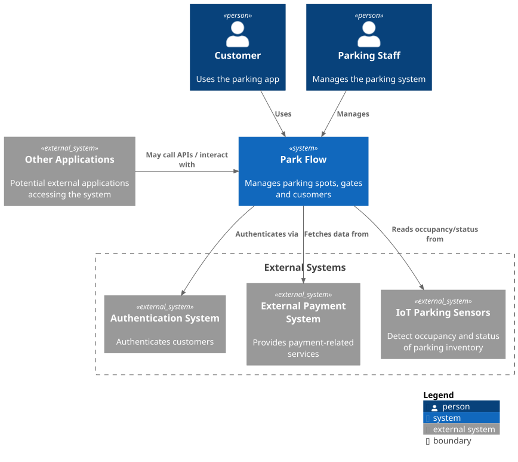

# Park Flow - Context Diagram

## System Context

This diagram shows the **Parking Management App** and its environment:

- **Customer**: Uses the app to register for and rent parking spots.
- **Parking Operator**: Manages the parking facility, including gates and spot availability.
- **Authentication System**: Verifies users before granting access to the app.
- **Payment System**: Handles payments and related financial transactions.
- **IoT Parking Sensors**: Send occupancy and status events to the app.
- **Other Applications**: Potential external systems that may integrate with the app in the future.

The arrows indicate the flow of information or events between actors and systems.