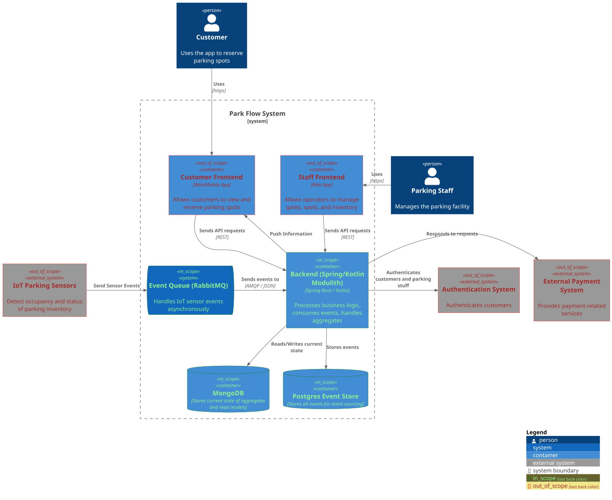

# Park Flow – C4 Model: Container Diagram

This document describes the Container Level (C4 – Level 2) of the Park Flow System.
It provides an overview of the main containers, their responsibilities, and how they interact with each other and with external systems.

## Overview

The Park Flow system consists of several containers that together enable customers and parking staff to interact with parking inventory, manage gates and spots, and process IoT sensor data.
Some containers are part of the work scope (developed in this project), while others are external systems that the Park Flow system integrates with.

The following diagram illustrates these containers and their relationships:

## Container Diagram

---

## Containers in Scope

### Backend (Spring/Kotlin Modulith)

- Central application that contains all business logic
- Processes commands and events
- Manages aggregates using event sourcing
- Consumes IoT sensor events via RabbitMQ
- Provides a REST API for both frontends

### MongoDB

- Stores the current state and read models
- Optimized for fast queries by the frontends

### Postgres Event Store

- Stores all domain events
- Acts as source of truth for rebuilding aggregates

### RabbitMQ

- Receives IoT sensor events asynchronously
- Ensures reliable processing by the backend

---

## Containers Out of Scope

### Customer Frontend (Web/Mobile)

- Used by consumers to register and rent parking spots
- Calls backend services

### Staff Frontend (Web App)

- Used by parking staff to manage gates and parking inventory
- Calls backend services

### Authentication System

- External identity provider (e.g., Keycloak)
- Authenticates customers and staff before they access the system

### External Payment System

- Handles external payment transactions
- Used for transactions related to rentable parking spots

### IoT Parking Sensors

- Installed in the parking facility
- Send occupancy and status updates as events

---

## Interactions

- Both frontends interact with the backend via REST APIs.
- IoT sensors publish events to the RabbitMQ queue, which the backend consumes.
- The backend authenticates users via an external identity provider.
- Payment-related workflows are delegated to an external payment service.
- The backend persists all events and state into Postgres and MongoDB.