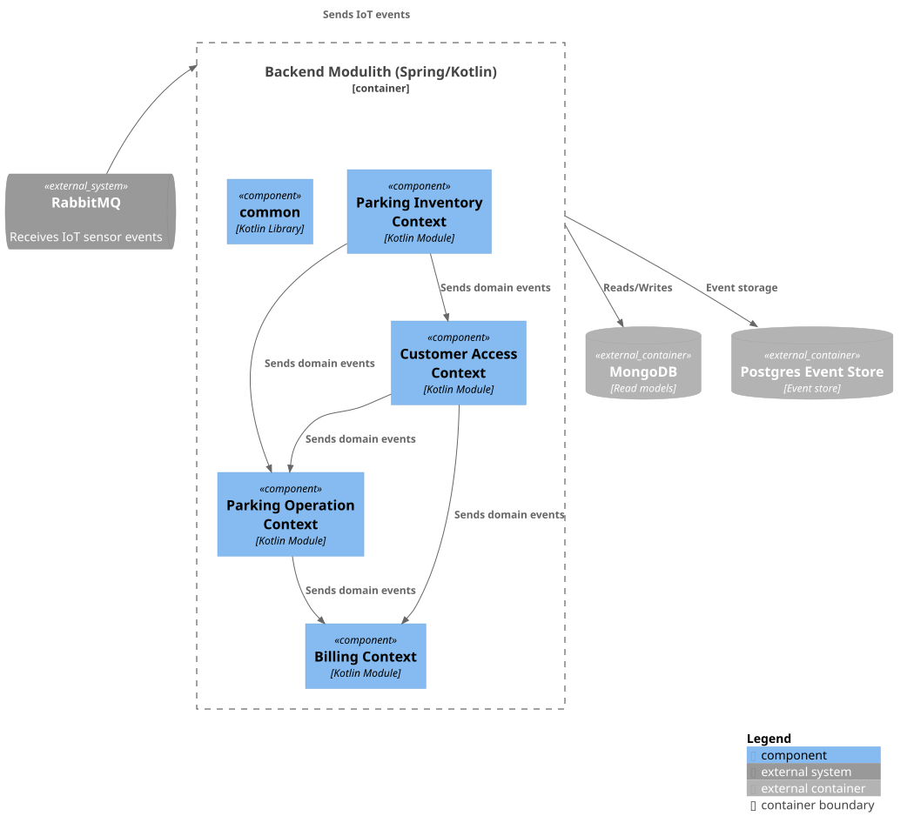

# Backend Modulith – Component View (Level 3)

This diagram illustrates the internal structure of the Backend Modulith (Spring/Kotlin).
The modulith is organized into several clearly separated bounded contexts following Domain-Driven Design (DDD), supported by a shared library.
All contexts communicate exclusively through domain events, ensuring loose coupling and high modularity.

## Container Diagram

---

## Bounded Contexts

### Parking Inventory Context
*"Manage the physical parking infrastructure”* \
This context is responsible for managing all elements of the parking infrastructure:

- Creating, modifying, and removing parking spots
- Managing parking spot types (e.g., disabled, rentable, electric)
- Managing gates (entry/exit)
- Publishing events whenever the parking inventory changes

It emits domain events consumed by:

- Customer Access
- Parking Operation

---

### Customer Access Context

*"Manage customer accounts, vehicles, and long-term rentals”* \
This context handles all customer-facing domain logic:

- Managing customer profiles and registered vehicles
- Handling long-term monthly parking spot rentals
- Canceling or updating rental contracts

It reacts to inventory events and publishes events for:

- Parking Operation (e.g., valid vehicle–spot assignments)
- Billing (e.g., rental contract created or terminated)

---

### Parking Operation Context

*"Operational control of parking activity”* \
This context handles the real-time operation of the parking system:

- Processing incoming IoT sensor events
- Assigning and releasing parking spots
- Managing vehicle entry and exit through gates
- Updating usage state based on sensor input

It consumes events from:

- Parking Inventory
- Customer Access

And produces domain events for:

- Billing

---

### Billing Context

*“Handle all financial processes”* \
This context manages all billing-related activities:

- Processing parking usage for billing
- Creating invoices
- Persisting relevant domain events for financial workflows

It consumes domain events from:

- Parking Operation
- Customer Access

--- 

### Common Library
A shared internal library used across all bounded contexts. It contains cross-cutting functionality that does not belong to a single domain:

- **Event Sourcing Module**
Provides the event sourcing infrastructure, including aggregates, serializers, event stores, and utilities.

- **System-wide Configuration**
Centralized configuration components shared across the modulith (e.g., messaging setup, persistence configuration, application-wide constants).

- **Helper Functions & Utilities**
Reusable helpers, extensions, and utility classes used by multiple bounded contexts.

---

## External System Interactions

The modulith integrates with several external components:

- **RabbitMQ** – receives IoT sensor events that are processed in the Parking Operation Context
- **MongoDB** – stores read models and the current state of aggregates
- **Postgres** Event Store – stores all domain events for Event Sourcing