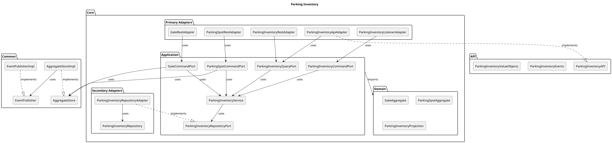

# Parking Inventory – Code View (Level 4)

This diagram shows the internal structure of the Parking Inventory Context within the Modulith, highlighting its **modules, ports, and adapters**. It focuses on the internal design and organization of the context, following a **hexagonal architecture** approach.

## Component Diagram

---

## Architectural Overview

At a higher level, the Parking Inventory module is structured into **API** and **Core** packages.

The **API package** represents the part of the module that can be imported and used by other modules in the modulith. In other words, this is the external-facing part of the module that exposes functionality to the outside world.

The **Core package** represents the internal, closed part of the module. It contains only elements that are used internally within the module. The Core package is implemented following a **hexagonal (Ports & Adapters) architecture**.

Additionally, there is a **Common package**, which contains reusable modules that can be used across all modules of the modulith. The Common package does not define domain logic itself. Its primary responsibility is to provide **cross-cutting functionality**, such as the **event mechanism**, which is utilized by all modules in the modulith.

The Core package itself is organized into **three layers**:

1. **Domain layer (center)**  
   The Domain layer contains the **core business logic** and is designed to remain independent from technical implementations. It primarily consists of **POKOs (Plain Old Kotlin Objects)**. The Domain layer is completely decoupled from infrastructure and external systems.

2. **Application layer (middle)**  
   The Application layer surrounds the Domain and consists of **Ports, Services, and Use Cases**.
    - **Ports** define the interfaces for interacting with the Domain and for exposing functionality to infrastructure or other modules.
        - **Primary ports** are interfaces through which the application can be used externally.
        - **Secondary ports** are interfaces that the application uses to interact with external infrastructure or services.
    - **Services and Use Cases** provide the necessary resources, orchestrate operations, and execute business logic in accordance with the Domain.

3. **Adapters layer (outer)**  
   The Adapter layer implements the technical aspects required to interact with the external world.
    - **Primary adapters** implement primary ports and expose the application’s functionality to clients or other modules.
    - **Secondary adapters** implement secondary ports and provide access to external systems, databases, or other infrastructure.

Together, this layered hexagonal design ensures that the Domain remains independent and testable, the application logic is clearly separated, and all technical concerns are handled by adapters.

This structure improves **modularity, testability, and maintainability**, while keeping the Domain pure and the module loosely coupled from its environment.

---

## Core Domain Components

### Aggregates
- **GateAggregate** – Represents gates (entry/exit) in the parking system, encapsulates gate state and operations.
- **ParkingSpotAggregate** – Represents individual parking spots, handles reservations and availability.
- **ParkingInventoryProjection** – Projection of parking inventory for read-models and query purposes.

### Value Objects & Events
- **ParkingInventoryValueObjects** – Domain-specific value objects.
- **ParkingInventoryEvents** – Domain events published when inventory changes.

---

## Application / Ports

### Command Ports
- **GateCommandPort** – Defines commands for gate operations.
- **ParkingSpotCommandPort** – Defines commands for parking spot operations.
- **ParkingInventoryCommandPort** – Commands for modifying inventory (e.g., add/remove parking spots).
- **ParkingInventoryRepositoryPort** – Interface for repository operations.

### Query Ports
- **ParkingInventoryQueryPort** – Interface for querying inventory state.

### Services
- **ParkingInventoryService** – Coordinates between aggregates and repository.

---

## Primary Adapters (Inbound)

- **GateRestAdapter** – REST controller for gate operations.
- **ParkingSpotRestAdapter** – REST controller for parking spot management.
- **ParkingInventoryRestAdapter** – REST API for querying inventory.
- **ParkingInventoryApiAdapter** – Implements **ParkingInventoryAPI** interface to expose inventory operations.
- **ParkingInventoryListenerAdapter** – Event listener for inventory events (e.g., sensor updates).

---

## Secondary Adapters (Outbound)

- **ParkingInventoryRepositoryAdapter** – Implements **ParkingInventoryRepositoryPort**, communicates with database.
- **ParkingInventoryRepository** – Actual repository (DB layer) storing aggregates.

---

## Relationships

- Adapters **implement interfaces** (Outbound or Command/Query Ports):
    - `..|>` labeled `implements` in diagram.
- Adapters **use services / ports**:
    - `-->` labeled `uses`.
- Domain events are **published** by aggregates/services and **consumed** by listener adapters and external contexts.

---

## Summary

The Level-4 diagram provides a **detailed view** of the Parking Inventory Context:

- Shows **domain aggregates** and **services**.
- Shows **ports** (command/query) and **adapters** (inbound/outbound).
- Explicitly shows **who implements what** and **who uses what**, making it clear how external systems interact with this context.
