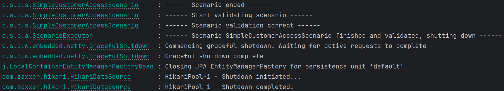

# Simple Customer Access

## Overview

| Parking Spots | Gates | Vehicles | Customers | Events | Duration |
|---------------|-------|----------|-----------|--------|----------|
| 9             | 0     | 6        | 3         | 44     | 1 min    |

## Tested Use Cases

The following use cases are tested:

| #  | Use Case            | Infos                                          | Result    |
|----|---------------------|------------------------------------------------|-----------|
| 1  | CreateCustomer      |                                                | Success   |
| 2  | CreateCustomer      |                                                | Success   |
| 3  | CreateCustomer      |                                                | Success   |
| 4  | ChangePaymentMethod |                                                | Success   |
| 5  | AddVehicle          |                                                | Success   |
| 6  | AddVehicle          |                                                | Success   |
| 7  | AddVehicle          |                                                | Success   |
| 8  | AddVehicle          | with existing PlateNumber                      | Error 400 |
| 9  | AddVehicle          | CustomerId not exists                          | Error 404 |
| 10 | RemoveVehicle       |                                                | Success   |
| 11 | RentParkingSpot     |                                                | Success   |
| 12 | RentParkingSpot     | ELECTRIC ParkingSpot with not electric vehicle | Error 400 |
| 13 | RentParkingSpot     | vehicle already has rented parking spot        | Error 400 |
| 14 | RentParkingSpot     |                                                | Success   |
| 15 | CancelParkingSpot   |                                                | Success   |
| 16 | RentParkingSpot     | ParkingSpot not RENTABLE                       | Error 400 |
| 17 | RentParkingSpot     | deactivated ParkingSpot                        | Error 400 |
| 18 | RentParkingSpot     | removed ParkingSpot                            | Error 400 |

## Successful Run

