# Realistic Small

A realistic scenario for a small parking lot. The scenario has one entrance. There are three waves of vehicles entering the parking lot through the entrance.
Each wave has 50 vehicles and between each wave is a pause of 10 minutes. 

## Overview

**Number of Parking Spots**: 100 \
**Number of Gates**: 1 \
**Number of Vehicles**: 150 \
**Time to reach the entrance**: 8–12 seconds \
**Time to reach the parking spot**: 1–2 minutes \
**Parking time**: 10–20 minutes \
**Time to reach the exit**: 1–2 minutes

## Successful Run

| Used Heap          | Max CPU | Runnable Thread Count | DB Events | DB Snapshots | Events Consumed Total | Events Consumed Rate | Events Published Total | Events Published Rate | Rabbitmq Received Total | Rabbitmq Received |
|--------------------|---------|-----------------------|-----------|--------------|----------------|-|-----------------|-|-------------------|-------------------|
| 507 MiB / 16,6 GiB | 13%     | 58                    | 1.000 kb  | 200 kb       | 3.557           | | 1.302          |  | 900               | 0,6/sek           |

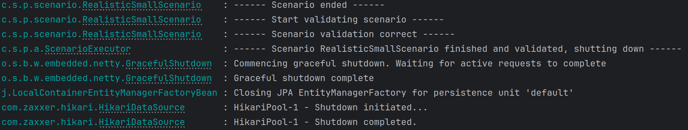

### System Metrics

### Pictures

#### JVM – Memory
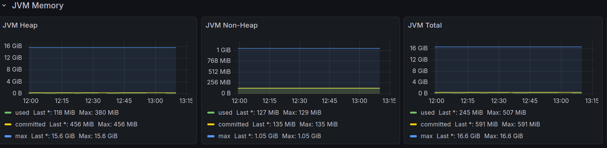

#### JVM - Memory Pools
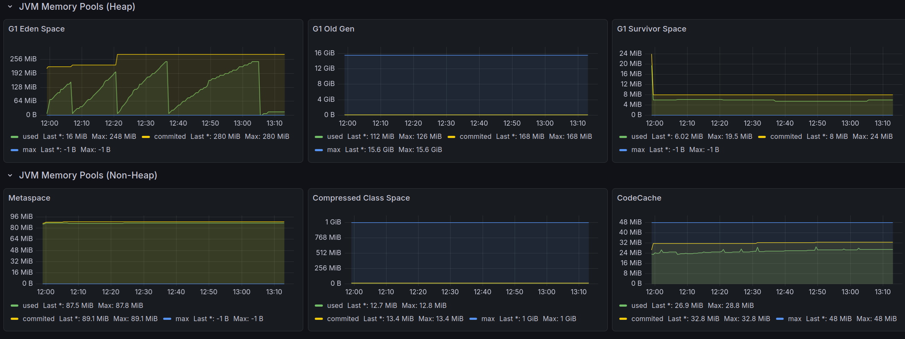

#### JVM - Misc
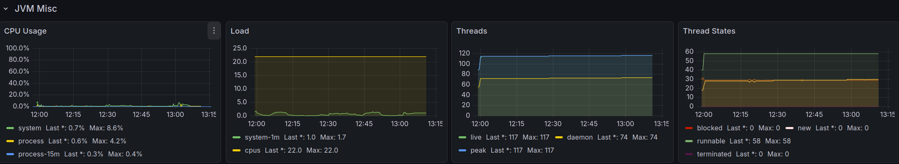

#### Garbage Collection
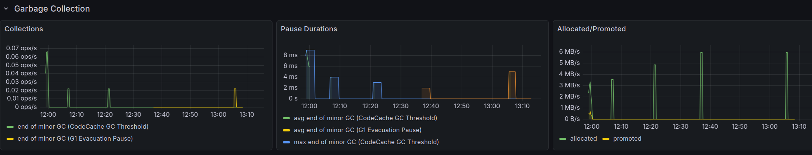

#### DB - Events
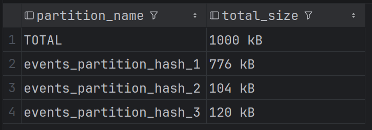

#### DB – Snapshots
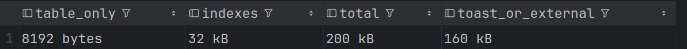

#### Spring Events Consumed
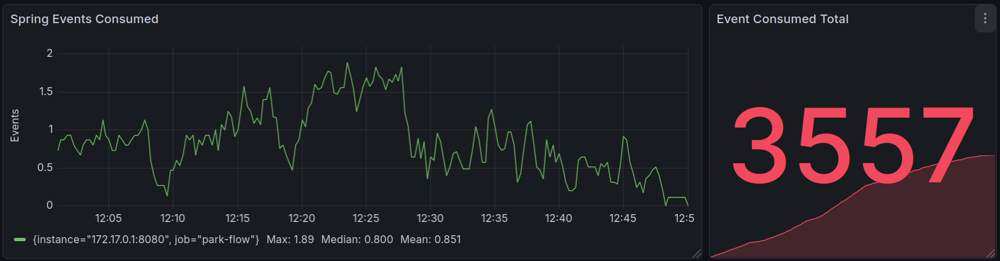

#### Spring Events Published
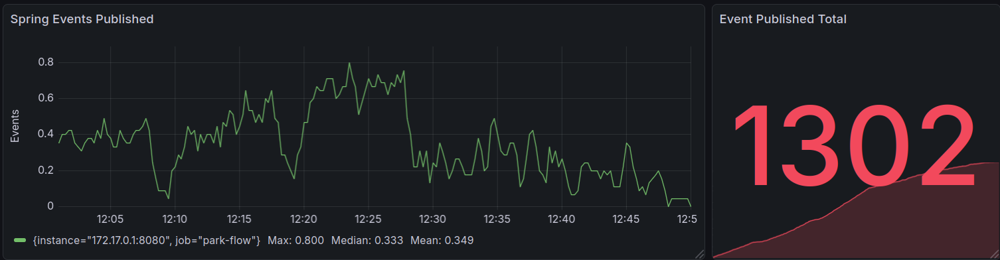

#### RabbitMQ – Received
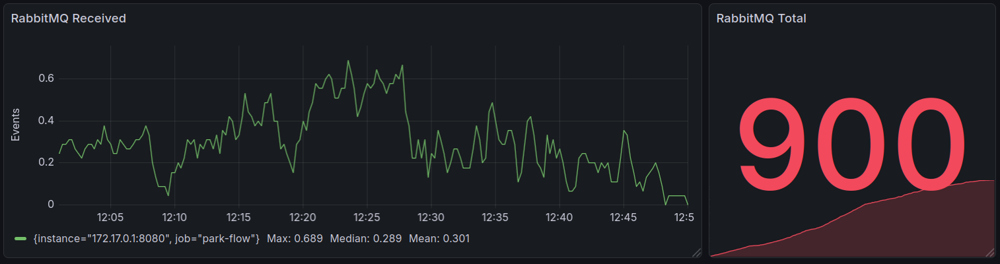

#### Vehicles Parked Correct
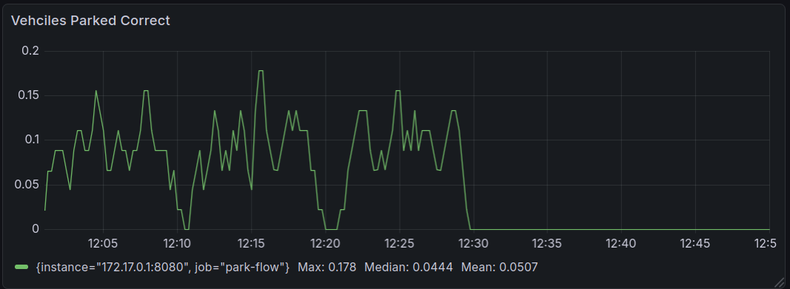
