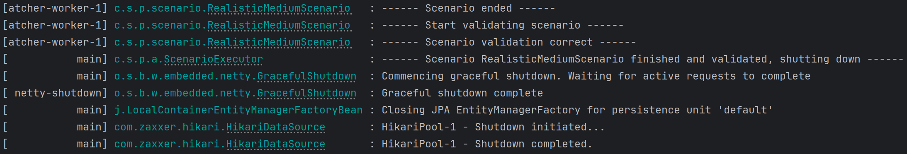
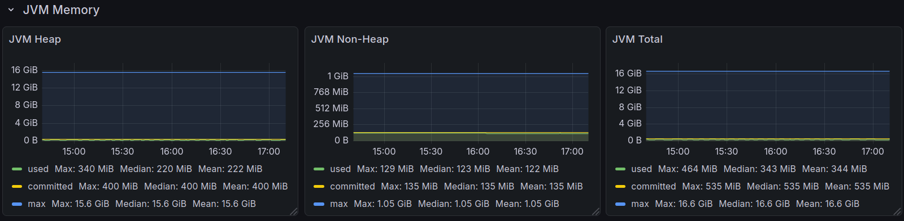
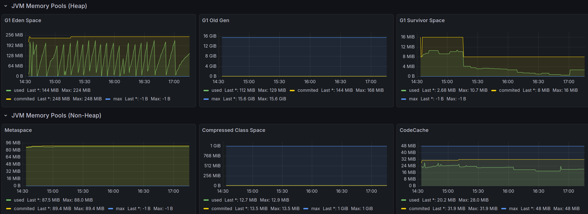
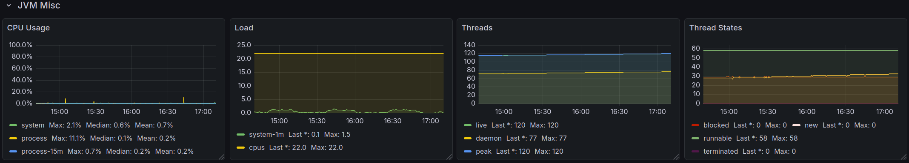
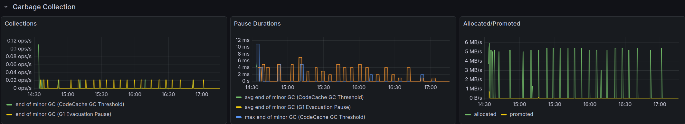
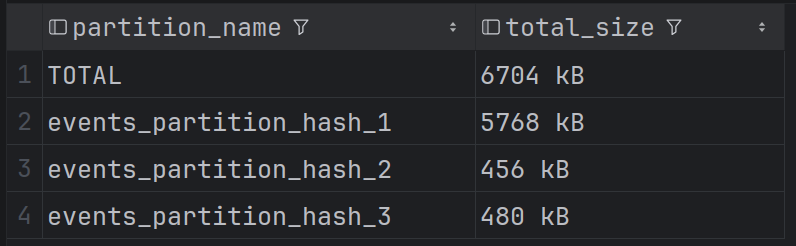
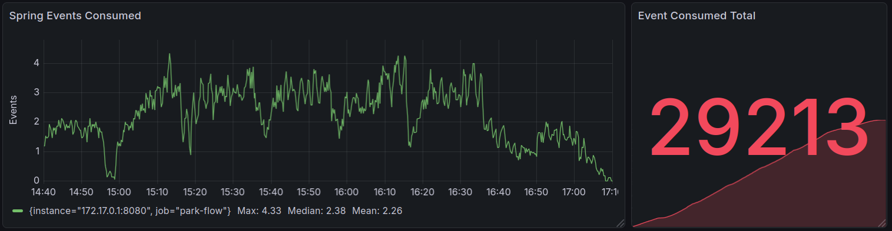
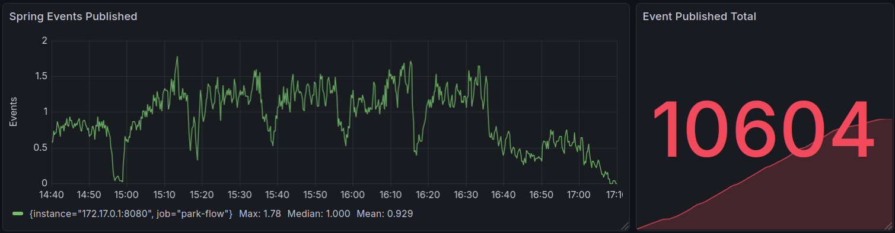
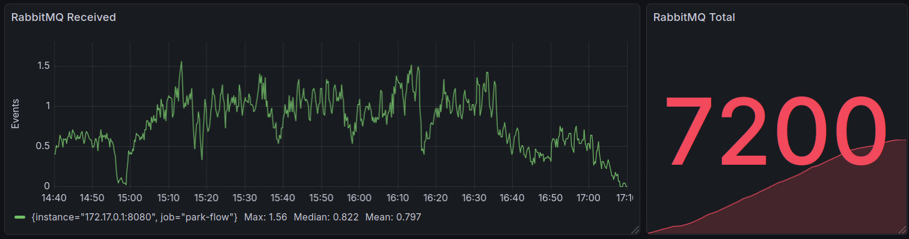
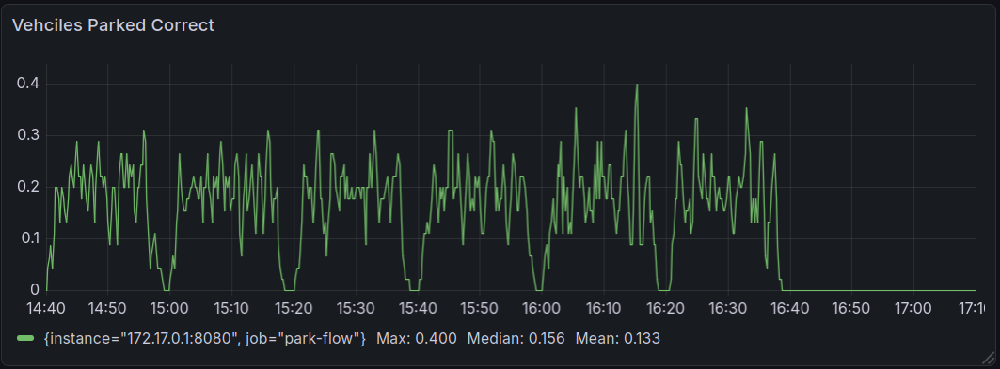

# Realistic Small

A realistic scenario for a medium parking lot. The scenario has two entrances. There are six waves of vehicles entering the parking lot through the entrance.
Each wave has 200 vehicles split on both entrances, and between each wave is a pause of 20 minutes.

## Overview

**Number of Parking Spots**: 1.000 \
**Number of Gates**: 2 \
**Number of Vehicles**: 1.200 \
**Time to reach the entrance**: 8–12 seconds \
**Time to reach the parking spot**: 1–3 minutes \
**Parking time**: 20–30 minutes \
**Time to reach the exit**: 1–3 minutes

## Successful Run

| Category         | Value           | medium           |
|------------------|-----------------|------------------|
| JVM Memory       |                 |                  |
|                  | max. used       | 464 MiB          |
|                  | median used     | 343 MiB          |
|                  | mean used       | 344 MiB          |
|                  | max. commited   | 535 MiB          |
|                  | median commited | 535 MiB          |
|                  | mean commited   | 535 MiB          |
|                  | max. maximal    | 16,6 GiB         |
|                  | median maximal  | 16,6 GiB         |
|                  | mean maximal    | 16,6 GiB         |
| CPU Usage        |                 |                  |
|                  | max. system     | 2,1%             |
|                  | median system   | 0,6%             |
|                  | mean system     | 0,7%             |
|                  | max. process    | 11,1%            |
|                  | median process  | 0,1%             |
|                  | mean process    | 0,2%             |
| Threads          |                 |                  |
|                  | max. live       | 120              |
|                  | max. peak       | 120              |
|                  | max. deamon     | 77               |
|                  | max. runable    | 58               |
| Database Storage |                 |                  |
|                  | Events          | 6.704 kB         |
|                  | Snapshots       | 272 kB           |
| Events Published |                 |                  |
|                  | Total           | 10.604           |
|                  | Max             | 1,78 events/sec  |
|                  | Median          | 1,0 events/sec   |
|                  | Mean            | 0,929 events/sec |
| Events Consumed  |                 |                  |
|                  | Total           | 29.213           |
|                  | Max             | 4,33 events/sec  |
|                  | Median          | 2,38 events/sec  |
|                  | Mean            | 2,26 events/sec  |
| Events RabbitMQ  |                 |                  |
|                  | Total           | 7.200            |
|                  | Max             | 1,56 events/sec  |
|                  | Median          | 0,822 events/sec |
|                  | Mean            | 0,797 events/sec |

### System Metrics

### Pictures

#### JVM – Memory

#### JVM - Memory Pools

#### JVM - Misc

#### Garbage Collection

#### DB - Events

#### DB – Snapshots

#### Spring Events Consumed

#### Spring Events Published

#### RabbitMQ – Received

#### Vehicles Parked Correct

