# Realistic Large Scenario

A realistic scenario for a large parking lot. The scenario has five entrances. There are four waves of vehicles entering the parking lot through the entrance.
Each wave has 3.000 vehicles split on all entrances.

## Overview

**Number of Parking Spots**: 10.000 \
**Number of Gates**: 5 \
**Number of Vehicles**: 12.000 \
**Time to reach the entrance**: 8–12 seconds \
**Time to reach the parking spot**: 1–4 minutes \
**Parking time**: 20–30 minutes \
**Time to reach the exit**: 1–4 minutes

## Successful Run

| Category         | Value           | medium        |
|------------------|-----------------|---------------|
| JVM Memory       |                 |               |
|                  | max. used       |  MiB          |
|                  | median used     |  MiB          |
|                  | mean used       |  MiB          |
|                  | max. commited   |  MiB          |
|                  | median commited |  MiB          |
|                  | mean commited   |  MiB          |
|                  | max. maximal    |  GiB         |
|                  | median maximal  |  GiB         |
|                  | mean maximal    |  GiB         |
| CPU Usage        |                 |               |
|                  | max. system     | %             |
|                  | median system   | %             |
|                  | mean system     | %             |
|                  | max. process    | %            |
|                  | median process  | %             |
|                  | mean process    | %             |
| Threads          |                 |               |
|                  | max. live       |               |
|                  | max. peak       |               |
|                  | max. deamon     |             |
|                  | max. runable    |             |
| Database Storage |                 |               |
|                  | Events          |  kB      |
|                  | Snapshots       |  kB        |
| Events Published |                 |               |
|                  | Total           |         |
|                  | Max             |  events/sec |
|                  | Median          |  events/sec |
|                  | Mean            |  events/sec |
| Events Consumed  |                 |               |
|                  | Total           |         |
|                  | Max             |  events/sec |
|                  | Median          |  events/sec |
|                  | Mean            |  events/sec |
| Events RabbitMQ  |                 |               |
|                  | Total           |          |
|                  | Max             |  events/sec |
|                  | Median          |  events/sec |
|                  | Mean            |  events/sec |

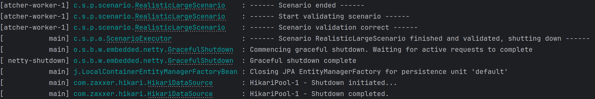

### System Metrics

### Pictures

#### JVM – Memory
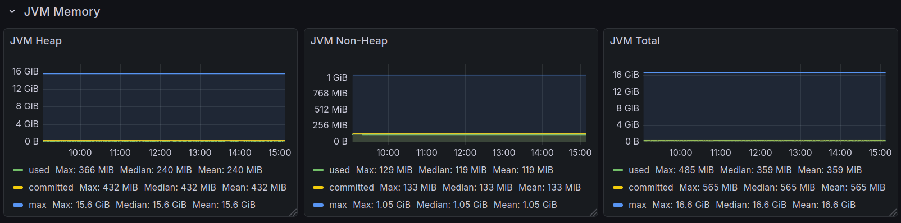

#### JVM - Memory Pools
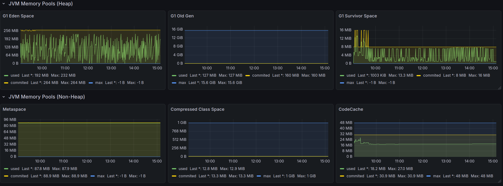

#### JVM - Misc
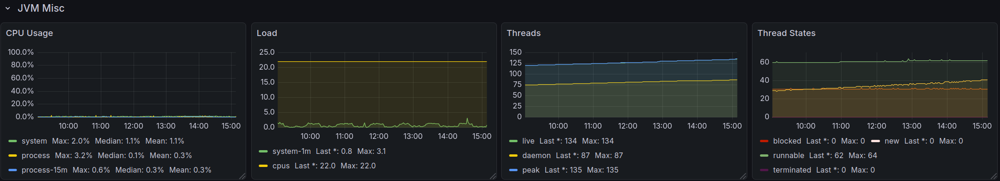

#### Garbage Collection
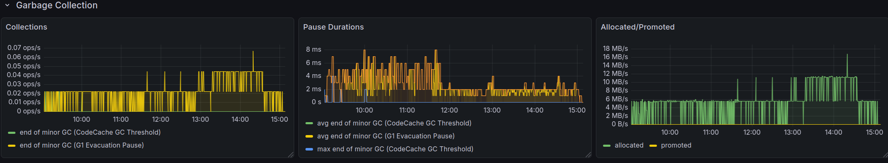

#### DB - Events
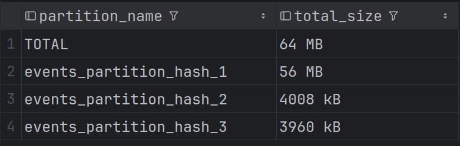

#### DB – Snapshots
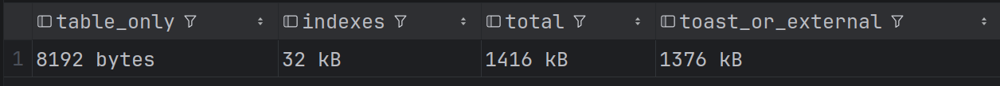

#### Spring Events Consumed
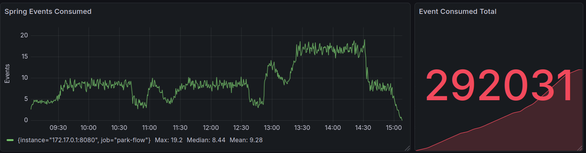

#### Spring Events Published
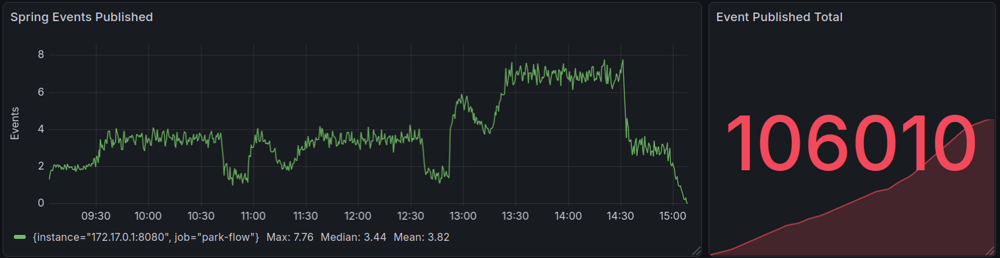

#### RabbitMQ – Received
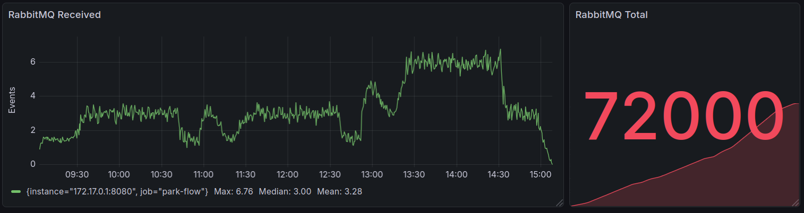

#### Vehicles Parked Correct
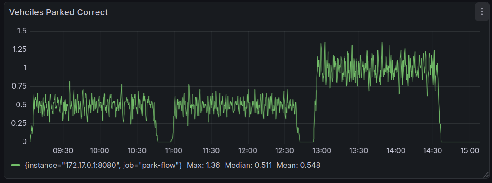
